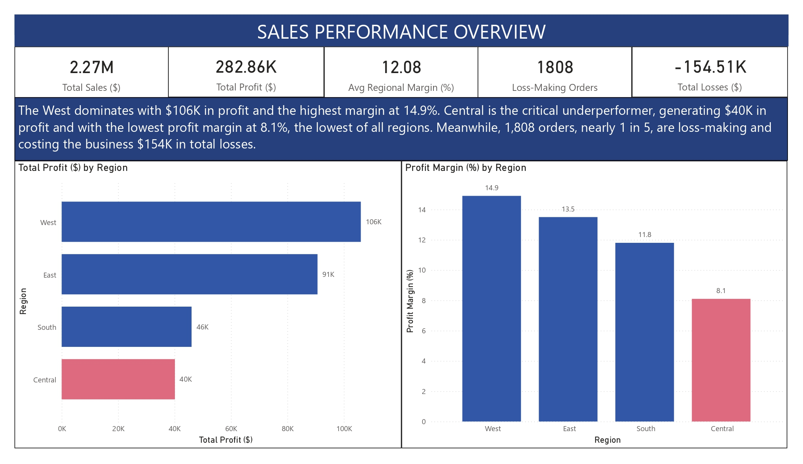
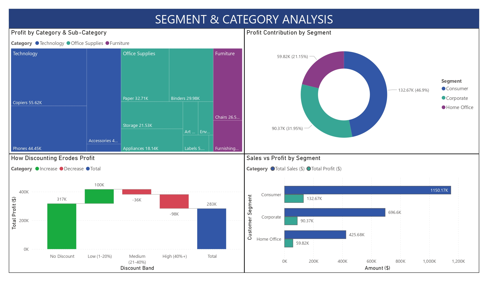
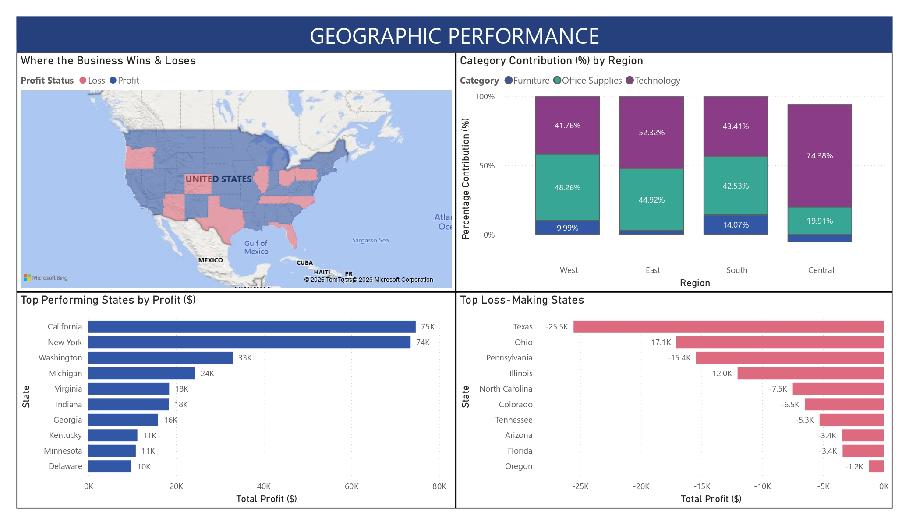
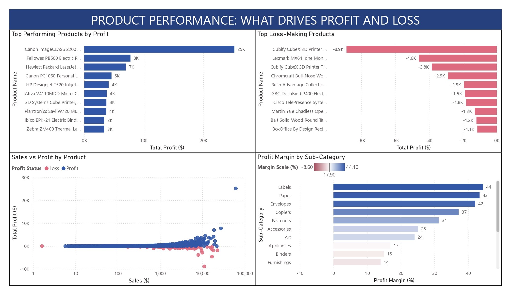

# Retail Profitability Analysis: Evaluating Discount Impact, Product Performance, and Regional Inefficiencies

> A data-driven analysis of how discounting, product performance, and regional dynamics impact retail profitability.

---

## 🧠 Executive Summary

This project analyzes retail sales performance to evaluate key drivers of profitability and identify sources of financial inefficiency. While total sales reached **$2.27M**, overall profit was limited to **$282.86K**, with **1,808 loss-making orders contributing to -$154.51K in losses**.

Profitability is uneven across regions, with the **Central region underperforming** at the lowest margin (8.1%), while the West and East regions drive the majority of profit.

Discounting is identified as the primary driver of profit erosion. Higher discount levels consistently reduce margins and, in many cases, result in losses. At the product level, several high-selling items generate low or negative profit, highlighting inefficiencies in pricing and discount strategies.

Overall, the analysis shows that strong revenue performance does not necessarily translate to sustainable profitability due to inconsistencies in pricing, product performance, and regional execution.

---

## 🚀 Next Steps (Business Actions)

- Optimize discount strategy by limiting high discount ranges (>20%)
- Review and adjust pricing for loss-making products
- Focus on high-margin categories and sub-categories (e.g., Technology, Labels, Paper)
- Improve performance in underperforming regions (Central)
- Implement data-driven pricing strategies aligned with profitability

---

## 📊 Dashboard Preview

### Sales Performance Overview


*Profitability is uneven across regions, with the Central region underperforming despite strong sales.*

---

### Segment & Category Analysis


*Discounting significantly reduces profitability, with higher discount levels leading to lower margins.*

---

### Geographic Performance


*Profit is driven by high-performing states, while losses are concentrated in specific regions and categories.*

---

### Product Performance


*High sales do not guarantee profitability, as several top-selling products operate at low or negative margins.*

---

## 💼 Business Problem

Retail organizations often prioritize revenue growth without fully understanding profitability drivers. High sales volume does not necessarily translate to strong financial performance, particularly when discounting strategies, product mix, and regional inefficiencies are not optimized.

Key questions addressed in this analysis:

- Which regions drive profit vs loss?
- How does discounting impact profitability?
- Are high-selling products actually profitable?
- Where are the biggest inefficiencies in performance?

---

## ⚙️ Methodology

- Data cleaning and aggregation using SQL  
- Feature engineering (profit margin, discount bands, profit classification)  
- Exploratory data analysis across regions, segments, and products  
- Data modeling and visualization in Power BI  
- Insight generation and business recommendation development  

---

## 🗄️ SQL Analysis & Data Preparation

SQL was used to transform raw transactional data into structured datasets for analysis.

### Regional Profitability Analysis
```sql
SELECT 
  region,
  ROUND(SUM(sales), 2) AS total_sales,
  ROUND(SUM(profit), 2) AS total_profit,
  ROUND(100 * SUM(profit) / SUM(sales), 1) AS profit_margin_pct
FROM superstore
GROUP BY region
ORDER BY total_profit DESC;
```

### Discount Impact on Profitability
```sql
SELECT
  CASE
    WHEN discount = 0 THEN 'No Discount'
    WHEN discount BETWEEN 0.01 AND 0.20 THEN 'Low (1-20%)'
    WHEN discount BETWEEN 0.21 AND 0.40 THEN 'Medium (21-40%)'
    ELSE 'High (40%+)'
  END AS discount_band,
  ROUND(SUM(profit), 2) AS total_profit,
  ROUND(100 * SUM(profit) / SUM(sales), 1) AS profit_margin_pct
FROM superstore
GROUP BY discount_band
ORDER BY profit_margin_pct DESC;
```

### Product-Level Profitability
```sql
SELECT 
  `Product Name`,
  ROUND(SUM(sales), 2) AS total_sales,
  ROUND(SUM(profit), 2) AS total_profit
FROM superstore
GROUP BY `Product Name`
ORDER BY total_profit DESC
LIMIT 10;
```

### Loss-Making Orders Analysis
```sql
SELECT 
  COUNT(*) AS total_orders,
  SUM(CASE WHEN profit < 0 THEN 1 ELSE 0 END) AS loss_making_orders,
  ROUND(100 * SUM(CASE WHEN profit < 0 THEN 1 ELSE 0 END) / COUNT(*), 1) AS loss_rate_pct
FROM superstore;
```
##### Note: Full SQL scripts are included in this repository for reference.
---
## 🛠️ Skills

- SQL (aggregation, CASE WHEN, data transformation)  
- Power BI (data modeling, DAX, dashboard design)  
- Exploratory Data Analysis (EDA)  
- Profitability and margin analysis  
- Data storytelling and business insights  

---

## 📈 Results and Business Recommendations

### Key Insights

- Profitability varies across regions, with Central underperforming  
- Discounting is the primary driver of profit erosion  
- High sales do not guarantee profitability  
- Profit and loss are driven by a small set of states and products  
- Profitability varies across sub-categories  

---

### Recommendations

- Optimize discount strategy  
- Review loss-making products  
- Focus on high-margin categories and sub-categories  
- Improve regional performance  
- Implement data-driven pricing strategies  

---

## 🚀 Future Work and Analytical Enhancements

- Incorporate customer-level analysis (LTV, retention)  
- Develop predictive models for profitability  
- Perform time-series and seasonality analysis  
- Conduct cost and operational analysis  
- Implement real-time dashboards

---
## 📊 Data Source
This project uses publicly available data from Kaggle for analytical purposes.

- Source: [here](https://www.kaggle.com/datasets/vivek468/superstore-dataset-final)

---

## 📁 Files Included
- Retail Profitability Analysis Report (PDF)
- Dataset (CSV)
- SQL Queries (CSV and SQL file)

---
## 💡 Key Takeaway
Profitability is not driven by sales volume alone. Discounting, product mix, and regional performance significantly impact the ability to convert revenue into sustainable profit.

---
⭐️ *Using data to uncover insights that drive better decisions.*
